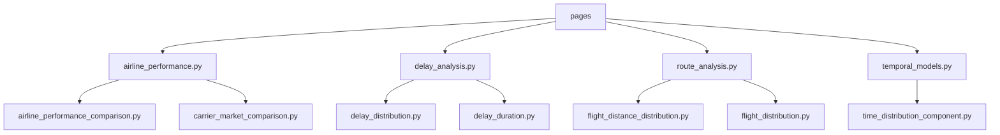
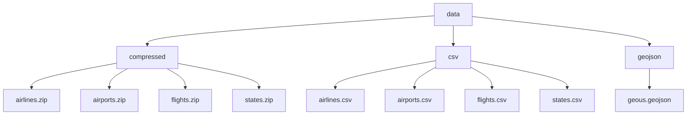

# Rapport

---

# User Guide

Afin de déployer et utiliser notre dashboard sur une autre machine voici ce qu’il faut faire. Avant toute chose il faut avoir cloné le repository, puis en se plaçant dans le dossier courant du projet il faut installer les requirements, lancer le fichier principal “main.py”.

```bash
git clone https://github.com/Mathatou/Data_Python.git
python -m pip install -r requirements.txt 
python main.py
```

Le jeu de données (plus d’informations dans la section suivante) est un extrait d’un fichier plus gros 80Go, nos données ne sont donc pas nécessairement les plus précises. 

Nous avons également un fichier *get_data.py* qui télécharge les données (ce qui pourrait nous permettre d’utiliser le jeu de données global ) puis un fichier *clean_data.py* qui va les nettoyer pour les préparer pour l’utilisation. Cependant, nous avons opté pour une autre méthode, nous avons gardé nos csv compressés et nous appelons notre fichier *extract_csv.py* qui les décompresse pour l’utilisation et l’analyse.

# Data

- **Airlines.csv :** Ce jeu de données représente les différentes compagnies de vols. Ce fichier est composé des nom des transporteurs ainsi qu’un code unique qui leur est attribué à chacun.
- **Airports.csv :** Ce jeu de données contient tous les aéroports, héliports et autres aérodromes présents aux États-Unis. Afin de se concentrer sur les données de vols d’avions, nous avons écartés tous type d’aérodromes n’étant pas un aéroport.
- **Flights.csv :** C’est le jeu de données principal que nous avons utilisé, il regroupe tous les vols aux États-Unis entre 1987 et 2020. De plus, en lien avec le fichier **Airports.csv**, nous avons également retiré tous les vols d’hélicoptères et aéronefs afin de ne garder que les vols d’avions.
    
    Ce faisant, nous avons identifié un problème dans notre jeu de données. Il n’y a aucun avion qui décolle depuis le Maryland. Nous pensons donc que notre jeu de données est erroné, ou que les données de vols du Maryland se situe dans le fichier global. 
    
- **States.csv :** Nous avons écris ce fichier regroupant le nom de chaque états (Alabama), leur code (AL) ainsi que leurs coordonnées géographiques (lat, long) .

# Developper Guide
```

├── airports_glossary.md
├── csv_utils
│   ├── clean_data.py
│   ├── download.py
│   ├── extract_csv.py
│   └── __init__.py
├── data
│   ├── compressed
│   │   ├── airlines.zip
│   │   ├── airports.zip
│   │   ├── flights.zip
│   │   └── states.zip
│   ├── csv
│   │   ├── airlines.csv
│   │   ├── airports.csv
│   │   ├── flights.csv
│   │   └── states.csv
│   └── geojson
│       └── geous.geojson
├── flights_glossary.md
├── get_data.py
├── main.py
├── README.md
├── requirements.txt
└── src
    ├── components
    │   ├── layout
    │   │   ├── footer.py
    │   │   └── navbar.py
    │   └── plot
    │       ├── airline_performance_comparison.py
    │       ├── carrier_market_comparison.py
    │       ├── delay_distribution.py
    │       ├── delay_duration.py
    │       ├── flight_distance_distribution.py
    │       ├── flight_distribution.py
    │       ├── __init__.py
    │       └── time_distribution_component.py
    ├── pages
    │   ├── airline_performance.py
    │   ├── delay_analysis.py
    │   ├── route_analysis.py
    │   └── temporal_models.py
    └── utils
        └── time.py
```







Dans chacun des différents fichiers dans le dossier plot_code, il y a une fonction *__init__* qui initialise une instance de la classe, puis une fonction *create_component(self)* qui va créer le graphique ou la carte correspondante. Dans le main, nous avons crée le dashboard et chaque composants sont générés grâce à l’appel de *create_component*.

Afin d’ajouter un plot au dashboard,  il suffit de décrire votre composant dans une classe qui sera  située dans le dossier plot_code. Une fois cela fait, il faut rajouter une ligne dans le dashboard en suivant ce qui a été fait précédemment et de rajouter *MaClasse.create_component()* dans le corps du dashboard.


# Rapport d’Analyse

Voici le compte rendu de nos analyses. Il est important de noter que les informations extraites de ce rapport ne sont pas complètement fiables, car bien que le jeu de données provienne d'une source officielle des États-Unis, les données que nous avons utilisées constituent un échantillon d'un ensemble plus large. De plus, un tri a été effectué pour ne conserver que les vols commerciaux, mais il est possible que certaines données liées à d'autres types de vols aient été incluses. Par conséquent, les résultats doivent être interprétés avec prudence, en tenant compte de ces limitations dans la précision des données utilisées.

### Analyse des Retards
L’analyse des retards révèle des tendances intéressantes qui nous permettent de mieux comprendre les moments où les passagers peuvent s'attendre à des perturbations dans leurs horaires de vol.

- Grâce à l’avant-dernier graphique, on observe que le nombre de retards commence à augmenter progressivement à partir des premières heures du matin (vers 5h-6h).
- Les retards atteignent un **pic en milieu ou fin de journée**, probablement entre 15h et 18h. Cela pourrait être lié à l'effet d'accumulation des retards, où les vols retardés en matinée impactent les vols ultérieurs.
- Les vols programmés très tôt (entre 0h-5h) et tard (22h-23h) présent beaucoup moins de retards. On peut expliquer ceci par un trafic aérien moins encombré.
- Les créneaux horaires les plus chargés en termes de départs (milieu de journée et après-midi) coïncident avec un nombre élevé de retards. Cela pourrait être dû à une saturation des aéroports et des contrôles, ainsi qu'aux effets boule de neige des retards précédents.

### Analyse des Itinéraires

Les graphiques relatifs aux itinéraires aériens offrent un aperçu précieux de la répartition des vols à travers les États-Unis, permettant de comprendre les zones de forte et faible densité de trafic aérien.

Sur la première carte, une concentration élevée de vols est clairement visible dans certains États. Les zones plus foncées, comme New York et la Californie, indiquent une fréquence de vols plus élevée. Cette tendance s’explique principalement par la forte densité de population et la présence de grands hubs aériens tels que New York City et Los Angeles, qui sont des points de connexion clés pour les vols nationaux et internationaux.

De plus, il est évident que les zones côtières des États-Unis, comme la côte Est et la côte Ouest, génèrent un volume de trafic aérien bien supérieur comparé au centre du pays. Cela reflète une réalité économique et démographique où les grandes métropoles et les zones littorales attirent une plus grande concentration de passagers, que ce soit pour des raisons économiques, touristiques ou professionnelles. Les centres économiques, comme San Francisco, Miami, et Washington D.C., sont donc des points névralgiques du réseau aérien.

À l’inverse, les États plus clairs, tels que le Dakota du Nord ou le Montana, présentent une densité de vols bien plus faible. Cela est dû à leur faible densité de population et à une attractivité touristique ou économique limitée à l’échelle nationale. Ces régions, plus rurales, voient moins de demande en termes de transport aérien, ce qui se traduit par un nombre de vols moins important.

### Performance des Compagnies Aériennes

Les graphiques ci-dessous offrent une vue d'ensemble détaillée sur la dynamique actuelle du marché aérien aux États-Unis, permettant non seulement de mieux comprendre les tendances de fréquentation, mais aussi d’aiguiller les voyageurs sur le choix de leur compagnie aérienne.

Delta Air Lines Inc. se distingue comme la compagnie aérienne américaine la plus empruntée, avec un total de 172 251 vols réalisés entre 2015 et 2020, selon la première carte et son graphique circulaire associé. Cette prédominance de Delta dans le ciel américain souligne la position de leader de la compagnie, qui bénéficie d'un réseau étendu et d'une forte demande sur ses liaisons.

Ensuite, le graphique en barres qui analyse les performances des différentes compagnies aériennes révèle des données cruciales sur la ponctualité et le taux d’annulation des vols. On y apprend que Envoy Air enregistre le plus grand nombre d'annulations, ce qui peut être un facteur dissuasif pour les voyageurs cherchant à éviter les désagréments. En revanche, JetBlue Airways se distingue par un taux de retard moyen élevé, ce qui pourrait être un critère important pour ceux qui privilégient la ponctualité.

### Analyse temporelle 
#### Distribution des départs d'avions au cours de la journée
Dans ces graphiques, plusieurs observations intéressantes émergent. D'une part, bien que cela puisse sembler contre-intuitif, la majorité des départs d'avions a lieu tôt le matin. Ensuite, le volume de départs se stabilise au cours de la journée avant de diminuer progressivement en soirée. Ce phénomène peut s'expliquer par des contraintes opérationnelles et logistiques, telles que la nécessité pour les avions d'effectuer des rotations optimales sur une journée ou encore les préférences des voyageurs pour des départs matinaux, notamment pour les trajets longs.

#### Variation du trafic aérien par jour de la semaine
De plus, contrairement à ce que l'on pourrait supposer, le samedi est significativement moins chargé en termes de trafic aérien. Cela peut être dû à des préférences de voyage des passagers, qui privilégient souvent les départs en semaine pour des déplacements professionnels, ou les vendredis et dimanches pour des voyages de loisir ou des week-ends prolongés.

#### Fluctuations mensuelles des vols
Concernant la répartition annuelle, les mois du début de l'année se distinguent par un volume de vols plus élevé. Cela pourrait être lié à plusieurs facteurs, tels que les vacances hivernales, la saison des fêtes qui s'étend jusqu'à janvier, ou encore le retour des voyageurs vers leur domicile après les congés de fin d'année.

#### Tendances sur plusieurs années
Lorsque l'on examine les tendances sur plusieurs années, une dynamique marquante est observée : le nombre de vols était en constante augmentation jusqu'en 2019. Cette croissance soutenue reflète l'expansion de l'industrie aérienne, notamment grâce à la hausse de la demande mondiale de voyages et à la démocratisation du transport aérien. Cependant, en 2020, une rupture brutale est visible en raison des restrictions liées à la pandémie de COVID-19, qui ont entraîné une chute drastique du trafic aérien. Les confinements, les fermetures de frontières et les mesures sanitaires ont contribué à cette diminution historique, marquant une période sans précédent dans l'histoire récente de l'aviation.

# Copyright

Pour ce projet, nous avons utilisé GitHub Copilot, une IA intégrée à nos IDE, comme assistance au développement. Bien que certaines parties du code aient été générées automatiquement, nous avons développé la majorité nous-mêmes.

Par ailleurs, nous avons apporté des modifications au fichier **States.csv** et à la structure du fichier **geous.geojson**.

# Ressources

En suivant ce lien, vous trouverez le glossaire concernant le fichier **Airports.csv,** renseignant sur les différentes données que l’on peut y retrouver.
[Glossaire de airports.csv](airports_glossary.md)

Idem pour celui-ci. Il renseigne sur **Flights.csv.**
[Glossaire de flights.csv](flights_glossary.md)
