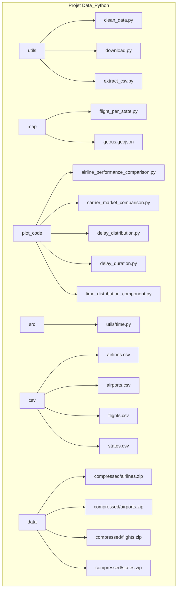

# Rapport Projet DataScience Python

---

- [ ]  Bien dire qu’il s’agit d’un extrait d’un fichier plus volumineux et que l’on ne sait pas vraiment comment les lignes ont été séléctionnés

# User Guide

Afin de déployer et utiliser notre dashboard sur une autre machine voici ce qu’il faut faire. Avant toute chose il faut avoir cloné le repository, puis en se plaçant dans le dossier courant du projet il faut installer les requirements, télécharger les fichiers nécessaires à l’aide du fichier “get_data.py” puis, lancer le fichier principal “main.py”.

```bash
git clone https://github.com/Mathatou/Data_Python.git
python -m pip install -r requirements.txt 
python main.py
```

- [ ]  Expliquer le get_data (pour potentiellement prendre le fichier de 80Gb)

# Data

- [ ]  Faire un tableau pour chaque qui explique le glossaire en français

- **Airlines.csv :** Ce jeu de données représente les différentes compagnies de vols. Ce fichier est composé des nom des transporteurs ainsi qu’un code unique qui leur est attribué à chacun.
- **Airports.csv :** Ce jeu de données contient tous les aéroports, héliports et autres aérodromes présents aux États-Unis. Afin de se concentrer sur les données de vols d’avions, nous avons écartés tous type d’aérodromes n’étant pas un aéroport.
- **Flights.csv :** C’est le jeu de données principal que nous avons utilisé, il regroupe tous les vols aux États-Unis entre 1987 et 2020. Nous avons décidé, afin d’alléger le fichier, les ressources utilisées et d’optimiser la vitesse du code, de ne garder que les données entre 2015 et 2020. De plus, en lien avec le fichier **Airports.csv**, nous avons également retiré tous les vols d’hélicoptères et aéronefs afin de ne garder que les vols d’avions.
- **States.csv :** Nous avons écris ce fichier regroupant le nom de chaque états (Alabama), leur code (AL) ainsi que leurs coordonnées géographiques (lat, long) .

# Developper Guide



- [ ]  Expliquer la structure des fichiers (quels sont les différentes fonctions que l’on retrouve dans tous les fichiers)

# Rapport d’Analyse

Suite à nos différentes analyses, on a pu arriver à multiples conclusions : 

### Performance des Compagnies Aériennes

- Premièrement, grâce à la première carte et à son graphique circulaire associé, on remarque que **Delta Air Lines Inc.** est la compagnie aérienne américaine la plus empruntée (172 251 vols entre 1987 et 2020)
- Deuxièmement, nous avons un graphique en barres qui donne des indications sur les performances des différentes compagnies aériennes. Le graphique nous renseigne sur le retard moyen ainsi que sur le taux d’annulation de vols. On voit que **Envoy Air** est la compagnie qui annule le plus ses vols et que **JetBlue Airways** est la compagnie

### Analyse des Retards

### Analyse des Itinéraires

# Copyright

Nous déclarons sur l’honneur que le code rendu a été produit par nous-même, ainsi que le fichier **States.csv** et  la structure du fichier **geous.geojson** a été modifiée.

# Ressources

[https://ourairports.com/help/data-dictionary.html](https://ourairports.com/help/data-dictionary.html)

En suivant ce lien, vous trouverez le glossaire concernant le fichier **Airports.csv,** renseignant sur les différentes données que l’on peut y retrouver.

[https://dax-cdn.cdn.appdomain.cloud/dax-airline/1.0.1/data-preview/index.html](https://dax-cdn.cdn.appdomain.cloud/dax-airline/1.0.1/data-preview/index.html)

Idem pour celui-ci. Il renseigne sur **Flights.csv.**